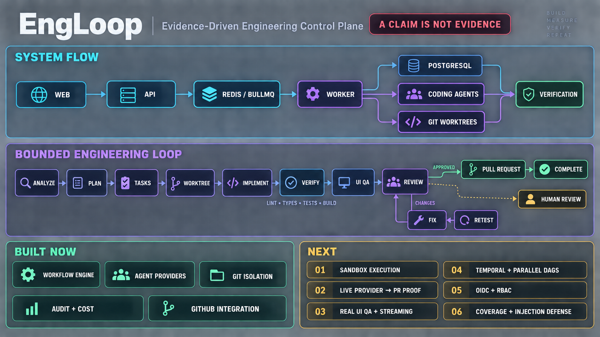
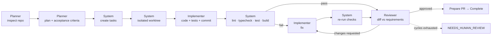

# EngLoop

**A multi-agent AI engineering orchestration platform.** EngLoop is an
engineering control plane, not a chat interface: it plans work, runs coding
agents against isolated git worktrees, verifies their output with commands it
runs itself, reviews the diff, bounds the fix loop, and opens a pull request —
while keeping every decision, every command and every dollar auditable.

The governing rule of the whole system:

> **A claim is not evidence.** No task is ever marked complete because an agent
> said it was. EngLoop runs lint, typecheck, tests and build itself and reads the
> exit codes.

---

## System at a glance



The visual summarizes the runtime path, the evidence-backed review loop, the
capabilities available today, and the next delivery priorities. The diagrams
and tables below provide the detailed, text-native reference.

---

## The loop



Roles are configuration, not code. `planner: codex`, `implementer: claude-code`,
`reviewer: codex` is one row per role — and equally `planner: gemini` or a
custom CLI agent. Nothing outside `packages/agent-sdk/src/providers/` names a
vendor.

---

## Run it with a real coding agent

Configure `.env` with a working Codex CLI login or worker-process API key and the
`ENGLOOP_BOOTSTRAP_*` owner/organization values. Mock execution is disabled by
default and remains available only when explicitly enabled for offline tests.

```bash
cp .env.example .env
pnpm install
docker compose up -d postgres redis
pnpm db:deploy && pnpm bootstrap:real
pnpm dev
```

Prisma runs **engine-free** here — no per-platform binaries are downloaded, so
`pnpm install` works behind a proxy allowlist and in slim images. See
[docs/adr/0001-engine-free-prisma.md](docs/adr/0001-engine-free-prisma.md).

| Service       | URL                              |
| ------------- | -------------------------------- |
| Web           | <http://localhost:3000>          |
| API           | <http://localhost:4000/api>      |
| Swagger       | <http://localhost:4000/api/docs> |
| Worker health | <http://localhost:4100/health>   |

Sign in with the owner credentials configured during `bootstrap:real`. Open a
real project/task on the board, choose **Start**, then **Open live run**.

---

## What's in the box

| Area                                                         | Status                              |
| ------------------------------------------------------------ | ----------------------------------- |
| Projects, repositories, epics, features, tasks               | Implemented                         |
| Task state machine (20 states, validated transitions)        | Implemented                         |
| Workflow engine, 12 steps, bounded review loop               | Implemented                         |
| BullMQ queues, idempotent jobs, crash-safe resume            | Implemented                         |
| Agent provider abstraction + opt-in mock provider            | Implemented                         |
| Codex / Claude Code CLI adapters                             | Implemented                         |
| Deterministic verification (lint · typecheck · test · build) | Implemented                         |
| Structured review findings + fix loop                        | Implemented                         |
| Git worktree isolation + secure command runner               | Implemented                         |
| Schedules (BullMQ repeatable jobs)                           | Implemented                         |
| Usage, cost, audit log, approvals, permission levels         | Implemented                         |
| Dashboard, Kanban, task detail, live run, agents, insights   | Implemented                         |
| UI QA pipeline                                               | Modelled; screenshot capture mocked |
| GitHub App connect + repository import                       | Implemented                         |
| Branch push + real pull requests via the GitHub App          | Implemented; not yet run end to end |
| Sandboxing, RBAC, billing                                    | Interfaces only                     |

---

## Repository layout

```
engloop/
├── apps/
│   ├── web/            Next.js 15 App Router — control plane UI
│   ├── api/            NestJS 11 REST API — the control plane
│   └── worker/         BullMQ worker — the only process that executes anything
├── packages/
│   ├── types/          Enums, domain events, API envelope (framework-free)
│   ├── schemas/        Zod contracts shared by web, API and worker
│   ├── workflow/       State machine, workflow definitions, orchestrator port
│   ├── git/            Command runner, git service, worktree manager
│   ├── agent-sdk/      CodingAgentProvider, registry, adapters
│   ├── db/             Prisma schema, client, seed
│   ├── logger/         Structured logging with correlation context
│   ├── ui/             Design-system primitives
│   ├── config/         Validated environment contract
│   └── testing/        Shared factories and assertions
├── docker/             Dockerfiles for api, worker, web
├── docs/               Architecture, workflow, security, API, database, roadmap
├── scripts/            bootstrap · clean · check
├── .ai/                Agent context files
└── AGENTS.md           Read this before changing anything
```

---

## Commands

```bash
pnpm dev            # web + api + worker in watch mode
pnpm build          # packages, then apps
pnpm lint           # ESLint, zero warnings tolerated
pnpm typecheck      # tsc --noEmit across the workspace
pnpm test           # Vitest unit + integration
pnpm test:e2e       # Playwright at 1440/1024/768/430/390/375
pnpm db:migrate <name>  # generate a migration from the schema diff
pnpm db:deploy      # apply pending migrations
pnpm db:baseline    # mark migrations applied without running them (existing schema)
pnpm db:status      # what is applied vs. pending
pnpm db:reset       # drop the schema and re-apply every migration
pnpm bootstrap:real # create the real owner, organization and provider
pnpm db:seed        # optional: load the Evalley demo dataset
pnpm docker:up      # start every service
pnpm docker:down    # stop them
./scripts/check.sh  # the full CI gate locally
```

`make help` lists the same targets.

---

## Architecture in one minute

Three processes, one direction of flow:

```
web ──REST──► api ──enqueue──► redis ──job──► worker ──► postgres
                │                                          │
                └───────────────── reads ──────────────────┘
```

The API **cannot** spawn a process or touch a working copy; the worker is the
only component that can. That is what makes independent verification structural
rather than a convention.

The workflow's routing policy is a **pure function** —
`decideEngineeringStep(state) → decision` — with no IO, clock or randomness. It
is unit-tested directly, including a test that drives the loop to completion and
fails if it does not terminate. Execution is one queue job per step, so a crash
resumes exactly where it stopped.

BullMQ sits behind a `WorkflowOrchestrator` port. A Temporal adapter implements
four methods; nothing else changes.

Full detail: [`docs/architecture.md`](docs/architecture.md) ·
[`docs/workflow-engine.md`](docs/workflow-engine.md) ·
[`docs/agent-provider.md`](docs/agent-provider.md) ·
[`docs/git-isolation.md`](docs/git-isolation.md) ·
[`docs/task-state-machine.md`](docs/task-state-machine.md) ·
[`docs/security.md`](docs/security.md) ·
[`docs/database.md`](docs/database.md) ·
[`docs/api.md`](docs/api.md) ·
[`docs/local-development.md`](docs/local-development.md) ·
[`docs/roadmap.md`](docs/roadmap.md)

---

## Safety model

Agent execution is untrusted. Every run gets an isolated worktree, an
allowlisted command set spawned with an argv array (never a shell string), an
execution timeout with a process-group kill, a token budget, a cost budget and
schema-validated output. Repository credentials are AES-256-GCM encrypted;
provider authentication comes only from the worker process environment and is
never returned by the API. Every agent start/stop, command, task transition, git action, approval
and configuration change is written to an append-only audit log.

Permission levels gate the loop: `LEVEL_0_OBSERVE` … `LEVEL_5_DEPLOY`, defaulting
to `LEVEL_3_PR`. A project below `LEVEL_2_CODE` plans and then stops — visibly,
with an approval request — rather than silently skipping a gate.

**Not yet implemented** (documented as placeholders, not protections): network
policy for agent processes, per-run resource limits, sandboxing, real GitHub App
authentication, per-resource RBAC. See [`docs/security.md`](docs/security.md).

---

## Definition of done

A task reaches `COMPLETED` only when every one of these holds — enforced in
`apps/worker/src/workflow/steps/finalize.ts`, re-derived from the database rather
than from accumulated workflow state:

requirements satisfied · acceptance criteria satisfied · implementation complete ·
lint passes · typecheck passes · tests pass · build passes · review passes ·
zero critical findings · zero high findings · worktree clean · changes committed
or explicitly recorded.

Anything short of that goes to `NEEDS_HUMAN_REVIEW`.

---

## Licence

Unlicensed / private. © Evalley.
