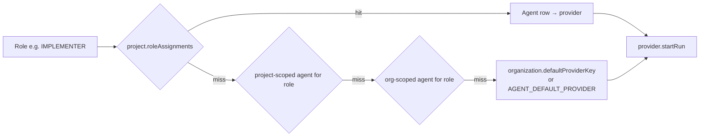

# Agent provider abstraction

## The interface

```ts
interface CodingAgentProvider {
  readonly key: string;
  readonly name: string;
  readonly kind: AgentProviderKind;
  readonly capabilities: ProviderCapabilities;

  startRun(context: AgentTaskContext): Promise<AgentRunResult>;
  resumeRun(sessionId: string, context: AgentContinuationContext): Promise<AgentRunResult>;
  cancelRun(runId: string): Promise<void>;
  healthCheck(): Promise<ProviderHealth>;
}
```

This is the only seam between EngLoop's business logic and any vendor. Nothing
outside `packages/agent-sdk/src/providers/` names Codex or Claude Code.

## Role resolution

Roles are never hardcoded to a provider. Resolution walks an override chain:



Configure it per organization or per project — the Agent Team screen writes
`project.roleAssignments`.

## Adapters

| Adapter                   | Kind          | State                                                                                                                                                             |
| ------------------------- | ------------- | ----------------------------------------------------------------------------------------------------------------------------------------------------------------- |
| `MockAgentProvider`       | `MOCK`        | **Fully implemented.** Simulates planning, implementation, review, fixing, latency, failure injection and findings. Requires no credentials.                      |
| `CodexAgentProvider`      | `CODEX`       | Implemented with stdin requests, OpenAI-compatible JSON Schema output, session/usage decoding and the CLI's `workspace-write` flag.                               |
| `ClaudeCodeAgentProvider` | `CLAUDE_CODE` | Implemented with stdin requests, JSON result envelopes, session/usage decoding, schema validation and role-based permissions (below). Serves every workflow role. |

Both CLI adapters extend `CliCodingAgentProvider`. They use the exported narrow
`AgentCommandExecutor` contract rather than depending on the concrete git
`CommandRunner`. A new CLI agent only supplies its argv builders.

## Execution runtime seam

The worker owns `AgentExecutionRuntime`. The current adapter is
`HostProcessExecutionRuntime`, reported honestly as:

```text
kind: HOST_PROCESS
isolated: false
```

It creates a run-id-scoped session immediately before CLI invocation, restricts
the cwd to that run's registered worktree, intersects the per-run command list
with the global `CommandRunner` allowlist, caps the requested timeout, attaches
only that run's credential environment, and clears the environment on release.
Cancellation and worker shutdown abort active session signals. Health probes use
a separate scope and never receive run credentials. Global Codex readiness runs
`codex --version`, which proves binary availability only. Authentication is
resolved per organization immediately before each run, so global readiness does
not validate every organization's stored key or CLI login.

`HOST_PROCESS` is not a sandbox. The child still runs as the worker OS user and
there is no filesystem namespace, network policy, CPU, memory, disk or PID
isolation. The raw `CommandRunner` remains available only to trusted worker git
and deterministic-test services.

## Claude Code permissions

Headless Claude Code (`claude -p`) cannot ask for permission, so the adapter
decides per role, and its explicit rules override the operator's own Claude
settings:

| Roles                                                    | Flags                                                                                                                                                                    |
| -------------------------------------------------------- | ------------------------------------------------------------------------------------------------------------------------------------------------------------------------ |
| Architect, planner, code/security/performance reviewers  | `--disallowedTools Edit Write MultiEdit NotebookEdit Bash` — read-only                                                                                                   |
| Implementer, backend/frontend/database/devops developers | `--permission-mode acceptEdits` — edits inside the task worktree (its working directory)                                                                                 |
|                                                          | `--allowedTools` — `git status/diff/log/show`, the lockfile install (`npm ci`, `pnpm install --frozen-lockfile`, …) and the `lint`, `typecheck`, `test`, `build` scripts |

Nothing else runs without a prompt, and a prompt in headless mode is a refusal:
no `git commit`/`push` (EngLoop commits), no dependency changes, no network tools.
Claude Code also refuses a chained command (`a && b`) unless every part matches.

On Windows, point `CLAUDE_CODE_CLI_PATH` at the native `claude.exe` (for example
`C:/Users/<you>/.local/bin/claude.exe`): the worker never uses a shell, so the npm
`claude.cmd` shim cannot be started.

## Credentials: stored key first, CLI login second

Provider API keys are configured in the UI (**Providers** → _Set key_, owners and
administrators only) and stored per organization as AES-256-GCM ciphertext on
`agent_providers`. The process environment is never consulted for a key.

| Provider    | Handed to the CLI as                 | Without a stored key                             |
| ----------- | ------------------------------------ | ------------------------------------------------ |
| Codex       | `CODEX_API_KEY` (+ `OPENAI_API_KEY`) | the `codex login` in `CODEX_HOME` (ChatGPT plan) |
| Claude Code | `ANTHROPIC_API_KEY`                  | the `claude` login (Claude subscription)         |

`codex exec` reads `CODEX_API_KEY` ahead of any stored login, and headless Claude
Code always uses `ANTHROPIC_API_KEY` when it is set, so a stored key wins and a
subscription's usage limit cannot stop a run. Clear the key from the UI to fall
back to the login.

At run time `AgentExecutor` resolves the key through `CredentialResolver`
(`apps/worker/src/services/credential-resolver.ts`), which decrypts it with
`SECRETS_ENCRYPTION_KEY` and caches it briefly. Immediately before invoking a CLI
provider, `AgentExecutor` prepares `HostProcessExecutionRuntime` for that run and
passes the resolved credential in the run-scoped `secretEnv`. It always releases
the runtime session in a `finally`, which clears the session and its credential
environment. The non-secret audit descriptor records the credential source and
applied limits, never secret values. A credential that cannot be decrypted fails
the run with `AGENT_PROVIDER_UNAVAILABLE` rather than silently downgrading to the
CLI login. The current adapter remains `HOST_PROCESS` with `isolated: false`.

Plaintext is never returned by the API: a write echoes a redacted preview
(`sk-••••••••mnop`) once, and reads report only `hasCredential` and
`credentialSource`.

## Never trust the output

Every response passes through the role's Zod schema twice — once inside the CLI
adapter and once in `AgentExecutor` — before any workflow state changes:

```ts
const parsed = parseSafely(ROLE_OUTPUT_SCHEMAS[role], result.output);
if (!parsed.ok) throw new AgentOutputInvalidError(provider.key, parsed.issues, raw);
```

Invalid output becomes an `AGENT_OUTPUT_INVALID` failure. It never becomes state.

## Adding a provider

1. Implement `CodingAgentProvider` (or extend `CliCodingAgentProvider`).
2. Declare `capabilities.roles`.
3. Register it in `apps/worker/src/context.ts`.
4. Add the provider kind to the real-bootstrap allowlist, then set its API key on the Providers screen.
5. Assign it to a role on the Agent Team screen.

No other file changes.

---

## Switching from the mock to a real CLI agent

Three things decide which provider serves a role, in this order:

1. the project's `roleAssignments` (an agent id per role),
2. an enabled `Agent` row for that role in the organization,
3. the organization's `defaultProviderKey`, falling back to `AGENT_DEFAULT_PROVIDER`.

Real mode does not seed an agent team. Configure the organization default with
`pnpm bootstrap:real`; optional agent rows can then override individual roles.

```bash
# .env — non-secret CLI wiring only
AGENT_DEFAULT_PROVIDER=codex
CODEX_CLI_PATH=/absolute/path/to/codex
CODEX_MODEL=gpt-6-astra
COMMAND_ALLOWLIST=...,codex           # the CLI must be allowlisted to be spawned

pnpm bootstrap:real                  # upserts the real organization/provider
```

Then set the API key on the **Providers** screen. Leave it unset to bill the
`codex login` instead.

`GET /health` on the worker reports each runtime adapter. Resolution fails
closed if the configured key is absent or cannot serve the role; it never
substitutes another provider. Mock mode is an explicit, offline-only opt-in.

### What a real run costs

The real bootstrap accepts Codex and Claude Code — both serve every mandatory
workflow role (architect, planner, implementer, code reviewer).

One historical task through plan → implement → verify → review → PR on `sonnet`,
against a small repository, measured rather than estimated:

| Role          | Tokens    | Cost      | Wall clock  |
| ------------- | --------- | --------- | ----------- |
| Architect     | 570.7k    | $0.23     | 1m 28s      |
| Planner       | 220.5k    | $0.11     | 43s         |
| Implementer   | 601.1k    | $0.23     | 1m 13s      |
| Code reviewer | 337.9k    | $0.17     | 1m 1s       |
| **Total**     | **1.73M** | **$0.73** | **~4m 30s** |

Token counts and cost come from the CLI's own result envelope, not from the
local pricing table — `AGENT_COST_BUDGET_USD` is therefore enforced against real
spend.
