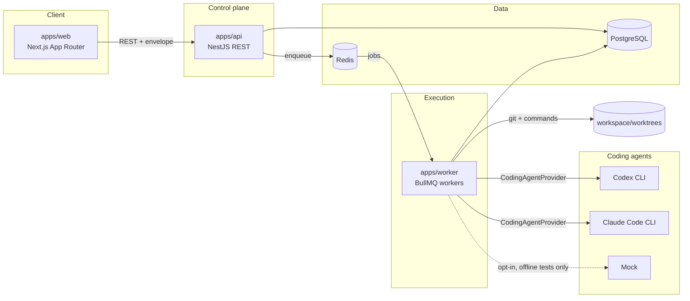
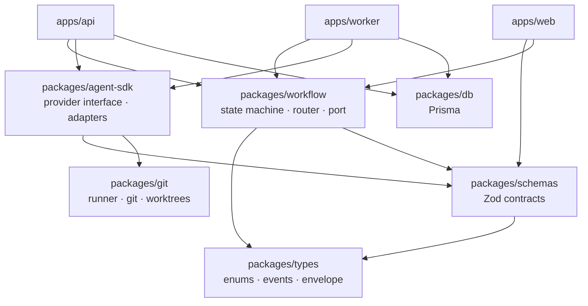
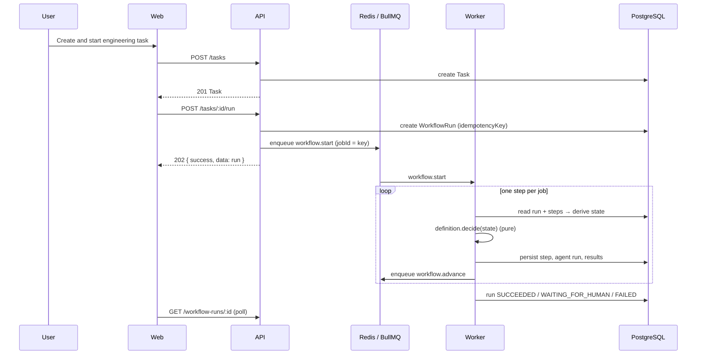
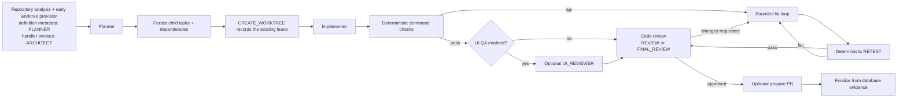

# Architecture

EngLoop is an engineering control plane: it coordinates coding agents, verifies
their work independently, and keeps the decisions, evidence and cost auditable.

## System shape

All three adapters implement `CodingAgentProvider` and are selected by
configuration, not by code. The mock is **disabled by default** and enabled only
by `AGENT_ENABLE_MOCK` for offline testing — real execution is the default path.

The API cannot spawn a process or touch a working copy. The worker is the only
component that can. That split is what makes "the platform verifies, the agent
merely claims" a structural property rather than a convention.

## Layering

Nothing in `packages/` depends on an app. `agent-sdk` knows nothing about tasks;
`workflow` knows nothing about Prisma; `web` never imports the database client.

## Request lifecycle

The browser uses TanStack Query for server state. Task, board, dashboard, and run queries poll at
configured intervals; the run detail currently polls every five seconds. No SSE or WebSocket
transport is present.

## Current engineering workflow

The workflow engine, rather than a supervisor agent, makes routing decisions. The planner's child
tasks and `TaskDependency` rows are durable planning artifacts, but this workflow does not yet
execute them as a child DAG. `RUN_TESTS` is deterministic system verification, not a `QA` role
agent. The repository-analysis step is declared with `PLANNER` metadata in the shared definition,
while its worker handler currently invokes `ARCHITECT`; the diagram records that source-level
discrepancy rather than choosing one label. That handler also provisions the isolated worktree
before planning; the later `CREATE_WORKTREE` handler records/reuses the lease. UI QA is optional,
and the router selects `REVIEW` or `FINAL_REVIEW` according to the remaining review budget. A
documentation role exists in the enum but is not a workflow step.

## Provider implementation

`apps/worker/src/context.ts` registers mock, Codex, and Claude Code adapters. Codex decodes JSONL,
sessions, usage, and a structured final message and runs in workspace-write sandbox mode. Claude
Code decodes its JSON result envelope and applies read-only permissions to planning/review roles
and a bounded edit/command allowlist to implementation roles. Provider selection is resolved from
project role assignment, organization agents/default, then environment configuration; failures do
not silently fall back to another provider.

## Current limitations

- Browser updates are polling, not pushed realtime.
- Planner-created child DAG tasks are not scheduled for execution.
- No real QA, documentation, or supervisor agent participates in the core workflow.
- UI screenshot capture, production sandboxing/resource limits, OIDC, full RBAC, and deployment
  automation remain incomplete.

## Key decisions

| Decision                                        | Why                                                                        |
| ----------------------------------------------- | -------------------------------------------------------------------------- |
| Provider abstraction (`CodingAgentProvider`)    | No business logic names a vendor; adding Gemini is one adapter plus a row. |
| Deterministic verification in the worker        | An agent's "tests pass" is a claim; exit codes are evidence.               |
| Pure routing function (`decideEngineeringStep`) | Replayable, unit-testable, and portable to Temporal unchanged.             |
| Orchestrator port                               | BullMQ is an adapter, not an assumption.                                   |
| One step per queue job                          | Crash-safe, individually retriable, resumable after restart.               |
| Enums defined once in `@engloop/types`          | Parity with Prisma is enforced by a test, not by discipline.               |
