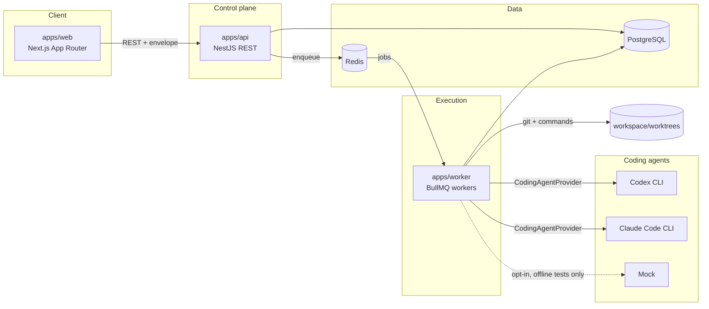
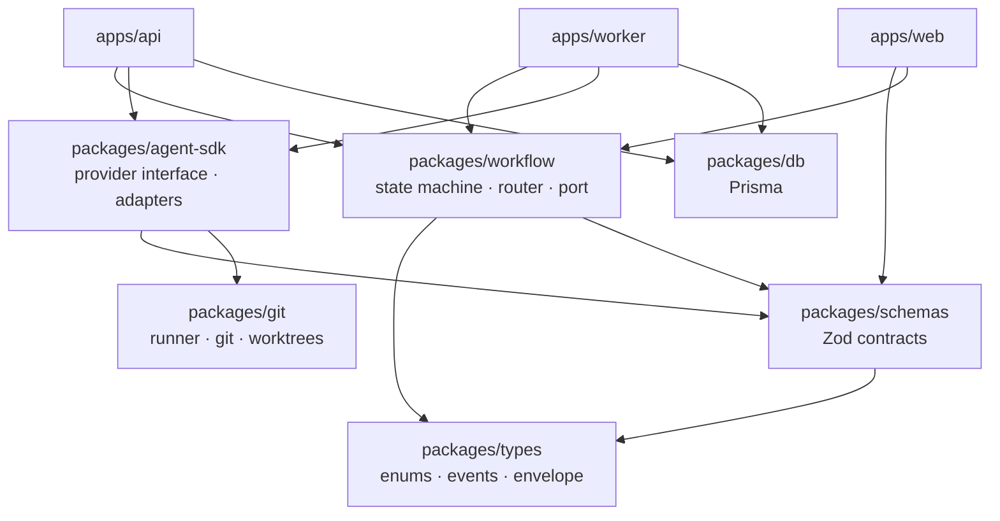
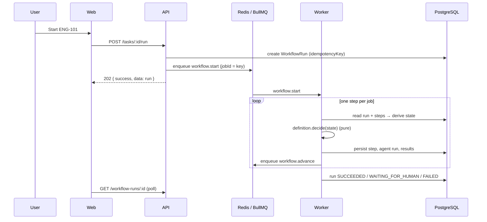

# Architecture

EngLoop is an engineering control plane: it coordinates coding agents, verifies
their work independently, and keeps the decisions, evidence and cost auditable.

## System shape

All three adapters implement `CodingAgentProvider` and are selected by
configuration, not by code. The mock is **disabled by default** and enabled only
by `AGENT_ENABLE_MOCK` for offline testing — real execution is the default path.

The API cannot spawn a process or touch a working copy. The worker is the only
component that can. That split is what makes "the platform verifies, the agent
merely claims" a structural property rather than a convention.

## Layering

Nothing in `packages/` depends on an app. `agent-sdk` knows nothing about tasks;
`workflow` knows nothing about Prisma; `web` never imports the database client.

## Request lifecycle

## Key decisions

| Decision                                        | Why                                                                        |
| ----------------------------------------------- | -------------------------------------------------------------------------- |
| Provider abstraction (`CodingAgentProvider`)    | No business logic names a vendor; adding Gemini is one adapter plus a row. |
| Deterministic verification in the worker        | An agent's "tests pass" is a claim; exit codes are evidence.               |
| Pure routing function (`decideEngineeringStep`) | Replayable, unit-testable, and portable to Temporal unchanged.             |
| Orchestrator port                               | BullMQ is an adapter, not an assumption.                                   |
| One step per queue job                          | Crash-safe, individually retriable, resumable after restart.               |
| Enums defined once in `@engloop/types`          | Parity with Prisma is enforced by a test, not by discipline.               |
