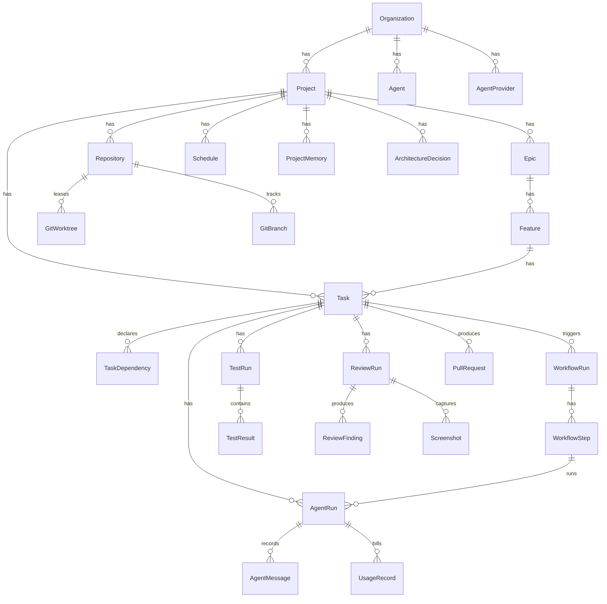

# Database

PostgreSQL 16 via Prisma 6. Schema: `packages/db/prisma/schema.prisma`.

## Model map



38 models in total. See the schema for the full field list.

## Conventions

- `cuid()` primary keys; `snake_case` table names via `@@map`.
- Money is `Decimal(12, 6)` — never `Float`.
- `UsageRecord` and `CostRecord` carry `occurredOn @db.Date` so the dashboards
  group by day with an index instead of a function.
- Composite indexes follow query order: `@@index([projectId, status])`.
- `WorkflowRun.idempotencyKey` is unique — replay-safe run creation.
- `WebhookEvent(source, externalId)` is unique — replay-safe webhook intake.
- UI findings reuse `ReviewFinding` via `uiCategory` + `viewport` +
  `screenshotId`, which keeps "open findings" one indexed query across code and
  UI review.

## Enum parity

Every Prisma enum must match `packages/types/src/enums.ts`.
`packages/db/test/enum-parity.spec.ts` parses the schema and fails the build on
any drift — 39 assertions covering 38 enums.

## Commands

```bash
pnpm db:generate       # regenerate the client
pnpm db:migrate <name> # generate a migration from the schema diff
pnpm db:deploy         # apply pending migrations (development, CI, production)
pnpm db:baseline       # record migrations as applied against an existing schema
pnpm db:status         # report applied vs. pending migrations
pnpm db:reset          # drop the schema and re-apply every migration
pnpm db:seed           # load the Evalley demo dataset
pnpm db:reset          # drop, re-migrate and re-seed
pnpm db:studio         # Prisma Studio
```
