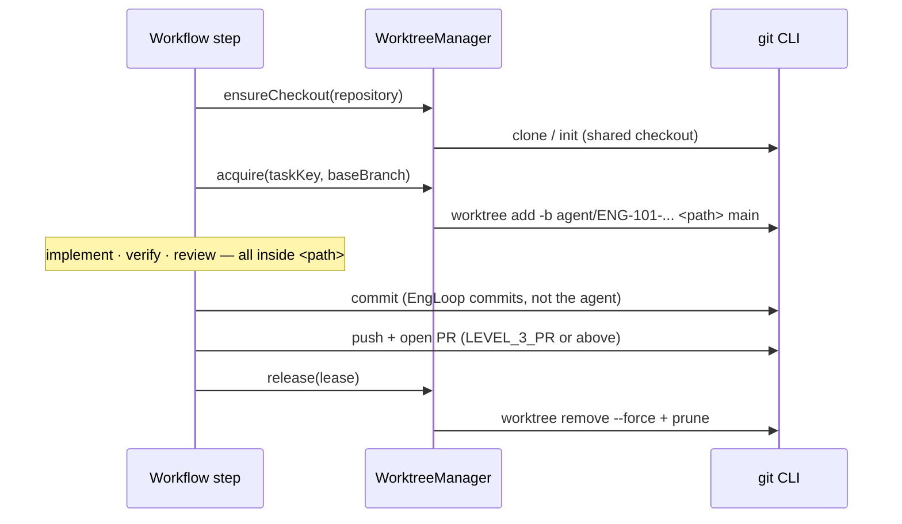

# Git isolation

## Layout

```
workspace/
├── repositories/          # shared clone — agents never receive this path
│   └── <repositoryId>/
├── worktrees/             # one isolated checkout per task
│   ├── ENG-101/
│   ├── ENG-102/
│   └── ENG-103/
└── artifacts/
```

`WorktreeManager` owns the boundary. `ensureCheckout()` clones or initialises the
shared repository; `acquire()` creates a `git worktree` for a task. Only the
worktree path is ever placed in an `AgentTaskContext`.

## Branch naming

```
agent/{task-key}-{slug}

agent/ENG-101-implement-organization-invitations
```

`sanitizeSegment()` collapses dot runs and replaces separators, so a hostile task
key such as `../../etc/passwd` cannot escape `workspace/worktrees/`
(`packages/git/test/paths.spec.ts` asserts this).

## Lifecycle



Re-acquiring an existing lease for the same branch returns it untouched, so a
retried step never wipes work in progress.

## Analysis runs in a worktree too

The spec orders `ANALYZE_REPOSITORY` before `CREATE_WORKTREE`. EngLoop
provisions the worktree during analysis (idempotently) and lets `CREATE_WORKTREE`
record the lease, so the invariant "no agent ever receives a path inside
`workspace/repositories/`" holds literally, for read-only steps as well.

## Local vs remote

`RepositoryProvider.LOCAL` is a first-class mode for development: no remote, no
credentials. `openPullRequest()` then records a pull request with `local: true`
so the workflow and the UI still complete end to end. A GitHub App integration
replaces exactly one method.
