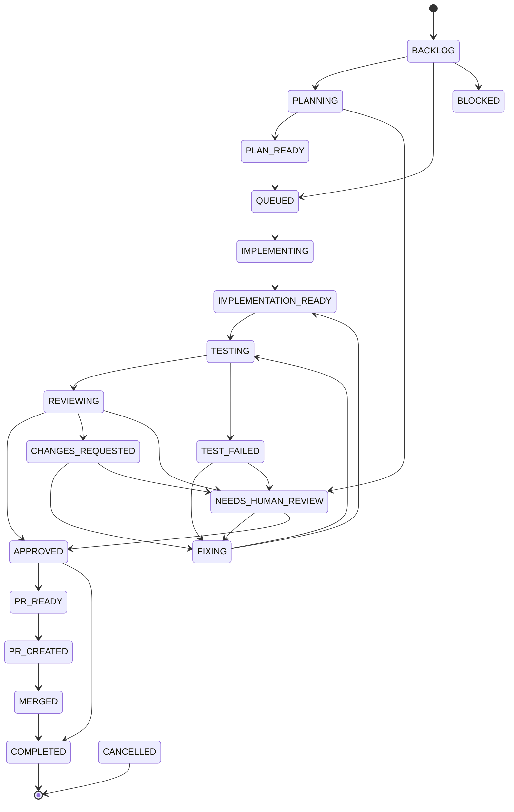

# Task state machine

`task.status` has exactly two writers: `TaskTransitionService` (API) and
`TaskTransitions` (worker). Both call `taskStateMachine.assert(from, to)` first,
so an illegal move is impossible rather than merely discouraged.

## Rules

- `COMPLETED` and `CANCELLED` are terminal; `nextStates` is empty for both.
- `TESTING → COMPLETED` is rejected with `409 TASK_INVALID_TRANSITION` — the
  exact example in the platform spec.
- Every stuck state can reach `NEEDS_HUMAN_REVIEW`.
- The machine has no non-terminal dead ends (asserted by a test).
- `path(from, to)` returns the shortest legal route, which is how the worker can
  request "get to QUEUED" without knowing the intermediate states.

## Board mapping

`BOARD_COLUMNS` in `@engloop/workflow` maps every status to exactly one Kanban
column, and a test asserts total, non-overlapping coverage. The board therefore
cannot disagree with the state machine about where a task belongs.
