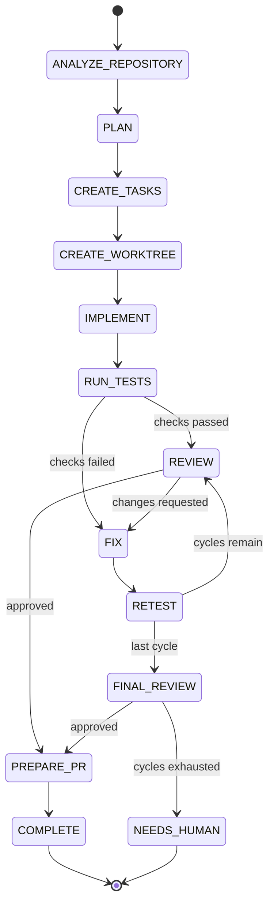

# Workflow engine

## The loop



## Design

The engine is split in two halves.

**The decision** is a pure function in `packages/workflow`:

```ts
decideEngineeringStep(state: WorkflowState): WorkflowDecision
```

No IO, no clock, no randomness. The same state always yields the same decision,
which is what makes the loop replayable and what lets the whole routing policy be
unit-tested without a database (`packages/workflow/test/engineering-workflow.spec.ts`,
including a test that drives the loop to completion and fails if it does not
terminate within 50 iterations).

**The execution** is `WorkflowEngine.advance()` in `apps/worker`. One call runs at
most one step:

1. Load the run and its step rows.
2. Rebuild `WorkflowState` — `completedSteps` is derived from the rows, not from
   the stored JSON, so a crash between "step succeeded" and "state written"
   heals on the next tick.
3. Ask the router what to do.
4. Execute the step handler, persist everything, merge the state patch.
5. Enqueue the next `advance` job, or finish the run.

## Bounded loop

Three counters bound the loop:

| Counter                | Default | Source                    |
| ---------------------- | ------- | ------------------------- |
| `maxReviewCycles`      | 3       | `project.maxReviewCycles` |
| `maxAttempts`          | 3       | `task.maxAttempts`        |
| per-step `maxAttempts` | 1–3     | step definition           |

When review cycles or attempts are spent, the decision is `WAIT_FOR_HUMAN`: the
run becomes `WAITING_FOR_HUMAN`, the task becomes `NEEDS_HUMAN_REVIEW`, and a
pending `Approval` row is created. There is no path that retries forever.

## Idempotency

Queue delivery is at-least-once, so:

- `WorkflowRun.idempotencyKey` is unique; a replayed start cannot fork a run.
- Job ids are derived (`start:<key>`, `advance:<key>`); BullMQ refuses a
  duplicate id.
- Step rows are reused for retries of one-shot steps and created fresh for cycle
  steps (`FIX`, `RETEST`, `REVIEW`), so a retry increments `attempt` instead of
  piling up rows.
- Worktree acquisition is idempotent: re-acquiring an existing lease on the same
  branch returns it rather than wiping work in progress.
- The test and review processors short-circuit when their row is already
  finished.

## Replacing BullMQ with Temporal

Everything above the queue depends only on `WorkflowOrchestrator`:

```ts
interface WorkflowOrchestrator {
  start(input: WorkflowStartInput): Promise<void>;
  advance(input: WorkflowAdvanceInput): Promise<void>;
  signal(signal: WorkflowSignal): Promise<void>;
  cancel(workflowRunId: string, reason: string): Promise<void>;
}
```

A Temporal adapter implements those four methods and calls the same
`WorkflowEngine.advance()`. No service, controller or step handler changes.
